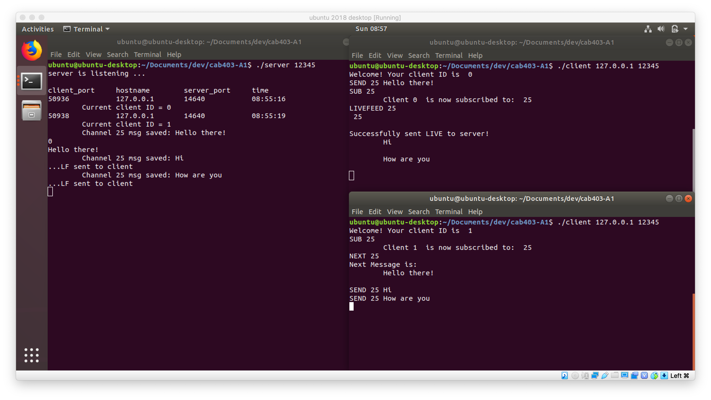

# Multi Client/Server System  (CAB403 Assignment 1)


## Features
The provided makefile yields two executables - the client and server;

### Client
- All connected clients can add a message to a particular channel
- Clients are subscribed to multiple channels and when any of the subscribed channels has a new message, the client can fetch and view
- Commands: SUB <channelID>, UNSUB <channelID>, CHANNELS, SEND <channelID> <msg>, NEXT, LIVEFEED, NEXT <channelID>, LIVEFEED <channelID>, BYE
- Usage:
```
  $ ./client [IP] [port]
  $ ./client localhost 12345
```

### Server
- A service to manage a queue of messages waiting to be delivered to connected + subscribed connections
- Usage:
```
  $ ./server [port]
  $ ./server 12345
```

## Authors
- [@phoebelestrange99](https://github.com/phoebelestrange99)
- [@g4b-y](https://github.com/g4b-y)

## Source Code
Unfortunately the source code cannot be released publicly, due to [QUT’s academic policy](http://www.mopp.qut.edu.au/C/C_05_03.jsp#C_05_03.06.mdoc). However, I am happy to provide prospective employers with a unique link to the private repository.
